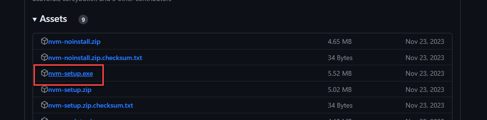
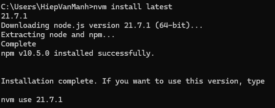
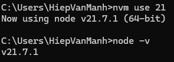
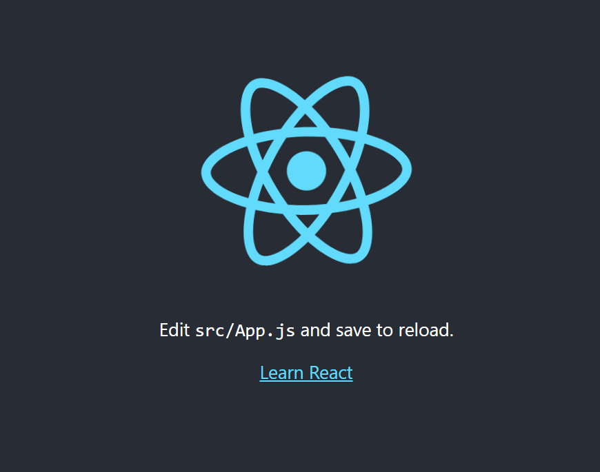
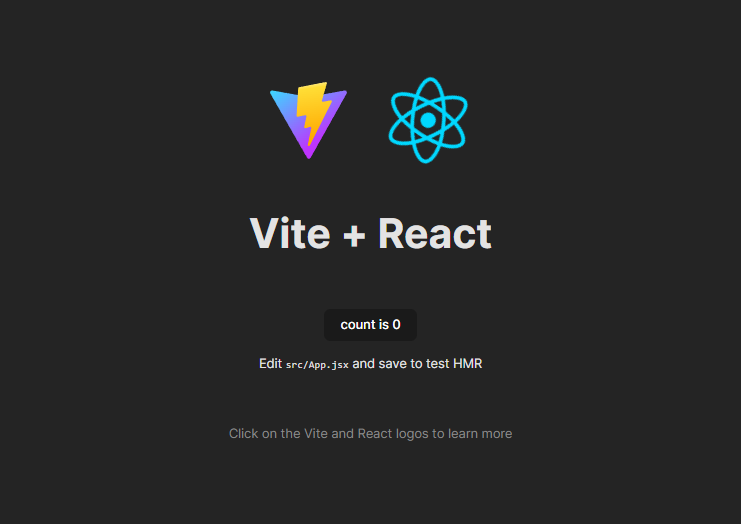

# Setting Up The Development Environment

## Introduction

This guide will walk you through the process of setting up a development environment for a React project using Node.js and NVM. We will also introduce how to initialize a React project using both NPX and Vite.

## Requirements

- Basic knowledge of JavaScript and React
- A computer running Windows operating system
- Internet connection

## Workspace Setup

### Install Node.js with NVM

1. Download and install NVM (Node Version Manager) from [here](https://github.com/coreybutler/nvm-windows/releases).

2. Open a new command prompt and install Node.js using NVM with the command: `nvm install latest`

3. Verify the installation with the command: `node -v`

### Create a React Project

#### Using NPX

1. Open a new command prompt.
2. Navigate to the directory where you want to create your project.
3. Run the command: `npx create-react-app my-app`

#### Using Vite

1. First, install create-vite globally with the command: npm install -g create-vite
2. Navigate to the directory where you want to create your project.
3. Run the command: create-vite my-app --template react
4. Navigate into the project directory with the command: cd my-app
5. Install dependencies with the command: npm install

## Initializing the Application

- After creating the project, navigate into the project directory with the command: `cd my-app`
- For NPX, start the application with: `npm start`

- For Vite, start the application with: `npm run dev`

## References

- [NVM for Windows](https://github.com/coreybutler/nvm-windows)
- [Create React App](https://create-react-app.dev/)
- [Vite](https://vitejs.dev/)
