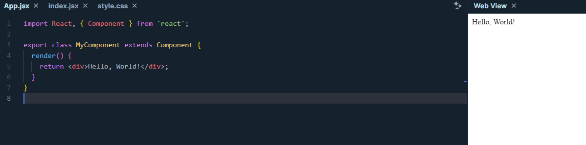
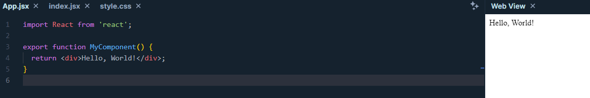
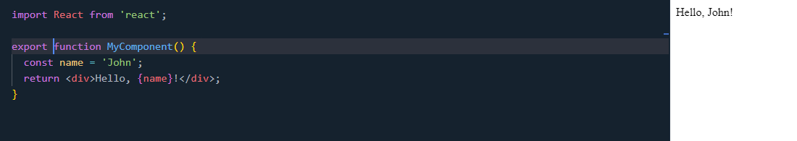
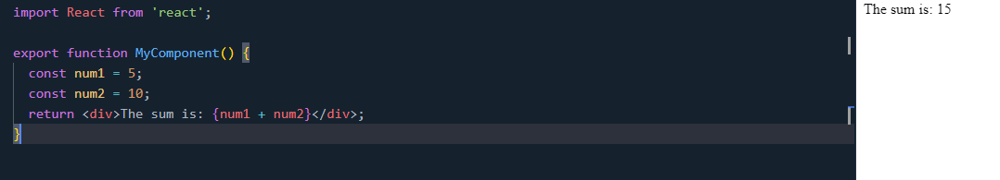

# Understanding React components and JSX

## Components

In React, Components are building blocks of applications. They help you to divide the user interface into small, reusable parts easily. A React application usually consists of multiple Components. Each Component can contain child components and can receive data from parent Components via props. There are two types of Components in React: Component Class and Function Component.

### Component Class

Component Class is a JavaScript class that extends `React.Component`. Previously, you could create Components through JavaScript classes. Here's an example of creating a Component Class.

```jsx
import React, { Component } from 'react';

class MyComponent extends Component {
  render() {
    return <div>Hello, World!</div>;
  }
}

export default MyComponent;
```



In the example above, `MyComponent` is a Component Class. It extends `React.Component` and has a `render` method that returns a React element. You can use `MyComponent` in other components like this:

```jsx
import React from 'react';
import MyComponent from './MyComponent';

function App() {
  return (
    <div>
      <MyComponent />
    </div>
  );
}
```

### Function Component

Function Component is a JavaScript function that returns a React element. This is a common way to create Components in React. Here's an example of creating a Function Component.

```jsx
import React from 'react';

function MyComponent() {
  return <div>Hello, World!</div>;
}

export default MyComponent;
```



In the example above, `MyComponent` is a Function Component. It returns a React element. You can use `MyComponent` in other components like this:

```jsx
import React from 'react';
import MyComponent from './MyComponent';

function App() {
  return (
    <div>
      <MyComponent />
    </div>
  );
}
```

## JSX

JSX is a part of React and is HTML-like syntax for writing user interface components. It helps you write HTML in JavaScript easily and efficiently. When you write JSX, you can also use JavaScript inside it.

### JSX Syntax

In JSX, you can easily combine JavaScript and HTML. Here's an example of using JSX.

```jsx
import React from 'react';

function MyComponent() {
  const name = 'John';
  return <div>Hello, {name}!</div>;
}

export default MyComponent;

```



In the example above, we use the variable `name` inside the React element. When you run the application, you'll see the result as a `div` element containing the content `Hello, John!`.

### Using JavaScript Expressions

You can also use JavaScript expressions in JSX. Here's an example of using JavaScript expressions in JSX.

```jsx
import React from 'react';

function MyComponent() {
  const num1 = 5;
  const num2 = 10;
  return <div>The sum is: {num1 + num2}</div>;
}

export default MyComponent;
```



In the example above, we use the expression `num1 + num2` inside the React element. When you run the application, you'll see the result as a `div` element containing the content `The sum is: 15`.

### Features of JSX

- Readable and writable: JSX makes your code easier to read and write.
- JavaScript expressions: You can use JavaScript expressions inside JSX.
- Easy integration: JSX can easily integrate with other libraries and frameworks.
- Reusability: JSX helps you reuse components easily.
- ... and many more features.

## Conclusion

Components and JSX are two important concepts in React. Understanding and using them effectively will help you build React applications quickly and efficiently.

## References

- [React Official Website](https://reactjs.org/)
- [JSX In Depth](https://reactjs.org/docs/jsx-in-depth.html)
- [Components and Props](https://reactjs.org/docs/components-and-props.html)
