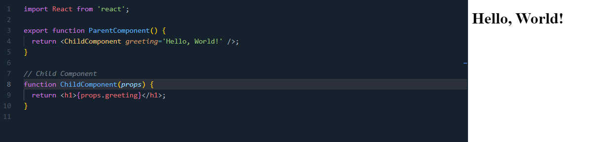
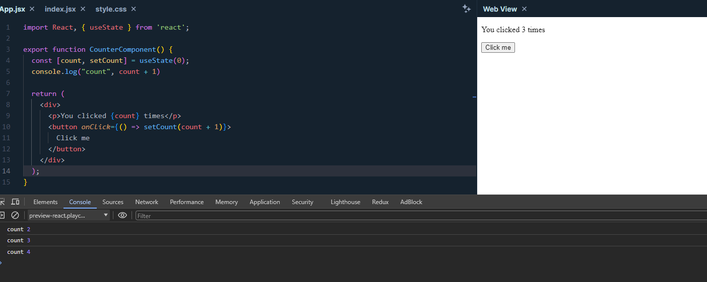

# Working with Props and State in React

## Introduction

Props and state are core concepts in React. They control the behavior of a component and render output. Props are immutable, meaning their values cannot be changed within the child Component. Meanwhile, state is mutable and managed by the component. In this article, we will explore props and state, as well as the differences between them.

## Props in React

Props (short for properties) are a way to pass data from parent components to child components through HTML-like syntax. Props make components flexible and reusable. A component can receive props as parameters and return React elements to display that data.

### Example of using props

```jsx
// Parent Component
function ParentComponent() {
  return <ChildComponent greeting="Hello, World!" />;
}

// Child Component
function ChildComponent(props) {
  return <h1>{props.greeting}</h1>;
}
```



In the example above, `ParentComponent` passes a prop `greeting` to `ChildComponent`. `ChildComponent` receives the value of the prop `greeting` through the `props` parameter and displays it within an `h1` tag. The result will be an `h1` tag containing the content `Hello, World!`.

## State in React

State is a data structure that starts with a default value when a component is mounted and then changes over time, usually due to user events. When the state changes, the component is re-rendered to display the new value. State is managed by the component and cannot be passed directly to child components (except through props or context). To use state, we need to use the `useState` hook from the `react` library.  

### Example of using state

```jsx
import React, { useState } from 'react';

function CounterComponent() {
  const [count, setCount] = useState(0);

  return (
    <div>
      <p>You clicked {count} times</p>
      <button onClick={() => setCount(count + 1)}>
        Click me
      </button>
    </div>
  );
}
```



In the example above, `CounterComponent` uses the `useState` hook to initialize a state `count` with a default value of `0`. Then, it displays the value of the `count` state within a `p` tag and a `button` to increase the value of the `count` state each time it is clicked. When the value of the `count` state changes, the component is re-rendered to display the new value. And in the console, you will see the value of the `count` state change each time you click the `Click me` button.

## Differences between Props and State

- Props are passed into the component (similar to function parameters) while state is managed within the component (similar to variables declared within a function).
- Props are fixed throughout the lifetime of a component. State can change over time.
- When state changes, the component is re-rendered.
- Props cannot be changed inside the child component. State can be changed inside the component.

## Conclusion

Understanding props and state is fundamental to building React applications. They allow components to be flexible and interactive.

## References

- [React Docs: Components and Props](https://legacy.reactjs.org/docs/components-and-props.html)
- [React Docs: State and Lifecycle](https://legacy.reactjs.org/docs/state-and-lifecycle.html)
