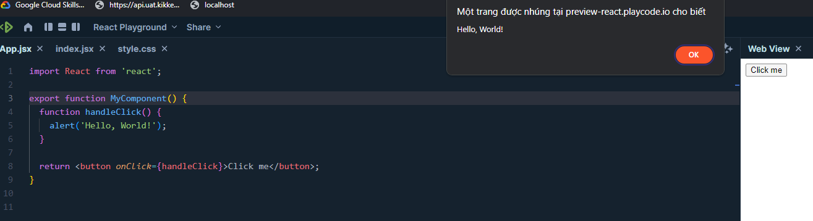
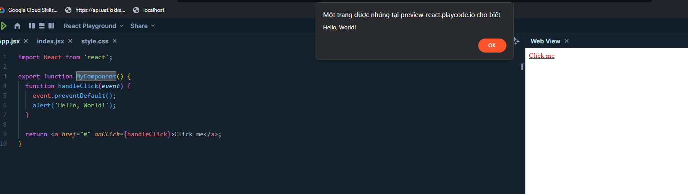
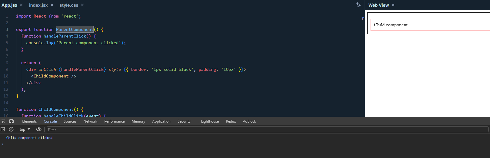
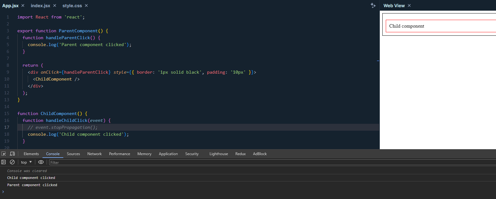
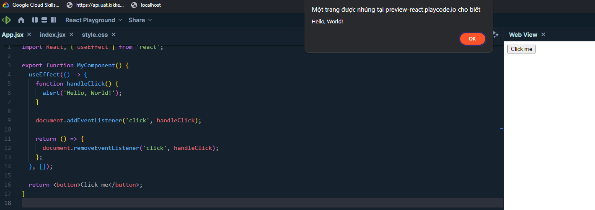
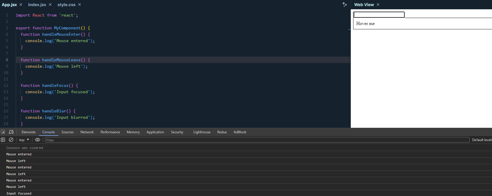
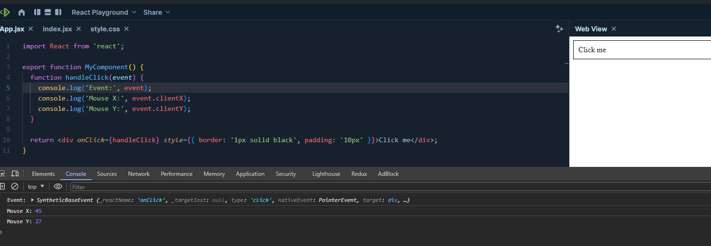

# Handling events in React

## Events in React

Events are actions that users perform on a browser, such as clicking, hovering, typing, and many more. In React, you can handle events by using event attributes.

### Syntax

```jsx
import React from 'react';

function MyComponent() {
  function handleClick() {
    alert('Hello, World!');
  }

  return <button onClick={handleClick}>Click me</button>;
}

export default MyComponent;
```



In the example above, we created a `MyComponent` component with a button. When the user clicks the button, the `handleClick` function is called and displays a alert message. You can also use the `onClick` event directly on HTML elements.

```jsx
import React from 'react';

function MyComponent() {
  return <button onClick={() => alert('Hello, World!')}>Click me</button>;
}

export default MyComponent;
```

### Passing Parameters to Event Handler Function

If you want to pass parameters to the event handler function, you can use a wrapper function to pass those parameters.

```jsx
import React from 'react';

function MyComponent() {
  function handleClick(name) {
    alert(`Hello, ${name}!`);
  }

  return <button onClick={() => handleClick('John')}>Click me</button>;
}

export default MyComponent;
```

In the example above, we passed the parameter `John` to the `handleClick` function when the user clicks the button. You can also use `bind` to pass parameters to the event handler function.

```jsx
import React from 'react';

function MyComponent() {
  function handleClick(name) {
    alert(`Hello, ${name}!`);
  }

  return <button onClick={handleClick.bind(null, 'John')}>Click me</button>;
}

export default MyComponent;
```

In the example above, we used `bind` to pass the parameter `John` to the `handleClick` function when the user clicks the button. Note that the first parameter of `bind` is `null` because we don't need to set the `this` value in the `handleClick` function.

### Default Events

When handling events in React, you can prevent the default behavior of the event by using the `preventDefault` method.

```jsx
import React from 'react';

function MyComponent() {
  function handleClick(event) {
    event.preventDefault();
    alert('Hello, World!');
  }

  return <a href="#" onClick={handleClick}>Click me</a>;
}

export default MyComponent;
```



In the example above, we used the `preventDefault` method to prevent the default click event behavior on the `a` tag, which prevents the browser from navigating to the URL specified in the href attribute. When the user clicks the button, the `handleClick` function is called and displays an alert message. You can also use `stopPropagation` to prevent event propagation.

```jsx
import React from 'react';

function ParentComponent() {
  function handleParentClick() {
    console.log('Parent component clicked');
  }

  return (
    <div onClick={handleParentClick} style={{ border: '1px solid black', padding: '10px' }}>
      <ChildComponent />
    </div>
  );
}

function ChildComponent() {
  function handleChildClick(event) {
    event.stopPropagation();
    console.log('Child component clicked');
  }

  return (
    <div onClick={handleChildClick} style={{ border: '1px solid red', padding: '10px', marginTop: '10px' }}>
      Child component
    </div>
  );
}

export default ParentComponent;
```



Clicking on the child component with stopPropagation()



Clicking on the child component without stopPropagation()

In the example above, we used the `stopPropagation` method to prevent the click event on the child element from propagating to the parent element. When the user clicks on the child element, the `handleChildClick` function is called, and a console message is displayed. However, the `handleParentClick` function is not called.

### External Events

When handling events in React, you can use the `addEventListener` method to register external events.

```jsx
import React, { useEffect } from 'react';

function MyComponent() {
  useEffect(() => {
    function handleClick() {
      alert('Hello, World!');
    }

    document.addEventListener('click', handleClick);

    return () => {
      document.removeEventListener('click', handleClick);
    };
  }, []);

  return <button>Click me</button>;
}

export default MyComponent;
```



In the example above, we used the `useEffect` hook to register a click event from outside. When the user clicks anywhere on the page, the `handleClick` function is called and displays an alert message. We also used the `removeEventListener` function to unregister the event when the component is unmounted.

### Optional Events

When handling events in React, you can use optional events like `onMouseEnter`, `onMouseLeave`, `onFocus`, `onBlur`, and many more.

```jsx
import React from 'react';

function MyComponent() {
  function handleMouseEnter() {
    console.log('Mouse entered');
  }

  function handleMouseLeave() {
    console.log('Mouse left');
  }

  function handleFocus() {
    console.log('Input focused');
  }

  function handleBlur() {
    console.log('Input blurred');
  }

  return (
    <div>
      <input type="text" onFocus={handleFocus} onBlur={handleBlur} />
      <div onMouseEnter={handleMouseEnter} onMouseLeave={handleMouseLeave} style={{ border: '1px solid black', padding: '10px' }}>
        Hover me
      </div>
    </div>
  );
}

export default MyComponent;
```



In the example above, we used optional events like `onMouseEnter`, `onMouseLeave`, `onFocus`, and `onBlur` to handle user behavior when hovering over elements and focusing on input fields.

### Event Object

When handling events in React, you can use the event object to access information about the event such as mouse coordinates, pressed keys, and many more.

```jsx
import React from 'react';

function MyComponent() {
  function handleClick(event) {
    console.log('Event:', event);
    console.log('Mouse X:', event.clientX);
    console.log('Mouse Y:', event.clientY);
  }

  return <div onClick={handleClick} style={{ border: '1px solid black', padding: '10px' }}>Click me</div>;
}

export default MyComponent;
```



In the example above, we utilized the event object to access the mouse coordinates when the user clicks on the element. When the user clicks on the element, the `handleClick` function is invoked, displaying the mouse coordinates in the console. You can also utilize the event object to access other information such as pressed keys, released keys, and much more.

## Conclusion

In this article, we have explored handling events in React using event attributes, passing parameters to event handler functions, preventing default event behavior, handling external event, optional event, and event object.

## References

1. [React - Handling Events](https://legacy.reactjs.org/docs/handling-events.html)
2. [W3Schools - HTML DOM Events](https://www.w3schools.com/jsref/dom_obj_event.asp)
