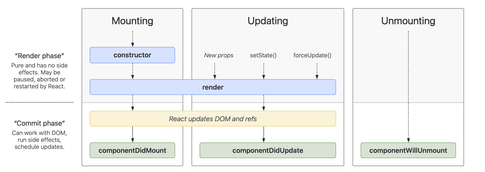
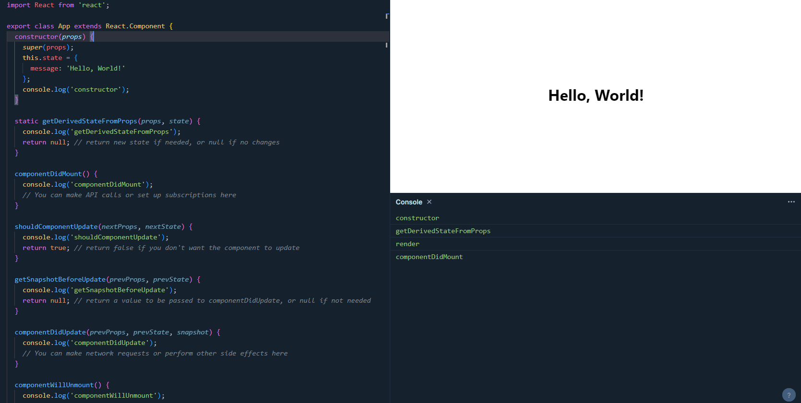

# React lifecycle methods

## Introduction

Lifecycle methods are special methods each component can have that allow us to hook into the views when specific conditions happen (e.g. when the component first renders or updates, when the component is removed from the DOM, etc.). In this lesson, we will learn about the lifecycle methods that are available in React.

## Lifecycle methods

Lifecycle of a component can be defined as the series of methods that are invoked in different stages of the component's existence. The three main stages are:

1. **Mounting**: The component is being created and inserted into the DOM.
2. **Updating**: The component is being re-rendered as a result of changes to either its props or state.
3. **Unmounting**: The component is being removed from the DOM.



### Mounting

The following methods are called in the following order when an instance of a component is being created and inserted into the DOM:

1. **constructor()**: This is the first method that gets called when the component is created. This method is used to set the initial state of the component, bind event handlers, etc.
2. **render()**: This is the only required method in a class component. It reads this.props and this.state, returning JSX that describes the UI.
3. **componentDidMount()**: This method is called after the component is rendered for the first time. This is where you can make API calls, set up subscriptions, or perform any other side effects.

### Updating

An update can be caused by changes to props or state. These methods are called in the following order when a component is being re-rendered:

1. static **getDerivedStateFromProps()**: This method is called every time a component is re-rendered. It is used to update the state based on changes in props.
2. **shouldComponentUpdate()**: This method is called before rendering when new props or state are being received. It is used to determine if the component should re-render or not.
3. **render()**: This is the only required method in a class component. It reads this.props and this.state, returning JSX that describes the UI.
4. **getSnapshotBeforeUpdate()**: This method is called right before the changes from the virtual DOM are to be reflected in the DOM. It allows you to capture some information from the DOM (e.g. scroll position) before it is potentially changed.
5. **componentDidUpdate()**: This method is called after the component is re-rendered. This is where you can perform any side effects such as making network requests, etc.

### Unmounting

This method is called when a component is being removed from the DOM:

1. **componentWillUnmount()**: This method is called when the component is about to be removed from the DOM. This is where you can clean up any side effects such as invalidating timers, canceling network requests, or cleaning up any subscriptions.

## Example

Let's create a simple class component that demonstrates the lifecycle methods:

```jsx
import React from 'react';

class ExampleComponent extends React.Component {
  constructor(props) {
    super(props);
    this.state = {
      message: 'Hello, World!'
    };
    console.log('constructor');
  }

  static getDerivedStateFromProps(props, state) {
    console.log('getDerivedStateFromProps');
    return null; // return new state if needed, or null if no changes
  }

  componentDidMount() {
    console.log('componentDidMount');
    // You can make API calls or set up subscriptions here
  }

  shouldComponentUpdate(nextProps, nextState) {
    console.log('shouldComponentUpdate');
    return true; // return false if you don't want the component to update
  }

  getSnapshotBeforeUpdate(prevProps, prevState) {
    console.log('getSnapshotBeforeUpdate');
    return null; // return a value to be passed to componentDidUpdate, or null if not needed
  }

  componentDidUpdate(prevProps, prevState, snapshot) {
    console.log('componentDidUpdate');
    // You can make network requests or perform other side effects here
  }

  componentWillUnmount() {
    console.log('componentWillUnmount');
    // You can clean up subscriptions, timers, etc. here
  }

  render() {
    console.log('render');
    return <h1>{this.state.message}</h1>;
  }
}

export default ExampleComponent;
```



In the above example, we have defined a class component called `App` that logs messages to the console at each stage of the component's lifecycle. You can see the order in which these methods are called when the component is created, updated, and removed. You can try adding this component to your React application and observe the console logs to understand the lifecycle methods better.

## Conclusion

In this lesson, we learned about the lifecycle methods that are available in React. These methods allow us to hook into the views when specific conditions happen (e.g. when the component first renders or updates, when the component is removed from the DOM, etc.). Understanding these methods is crucial for building React applications.

## References

- [React Lifecycle Methods](https://reactjs.org/docs/react-component.html)
- [React Lifecycle Diagram](https://projects.wojtekmaj.pl/react-lifecycle-methods-diagram/)
- [Explain React Lifecycle](https://www.explainthis.io/en/swe/react-lifecycle)
- [ChatGPT](https://chat.openai.com/)
