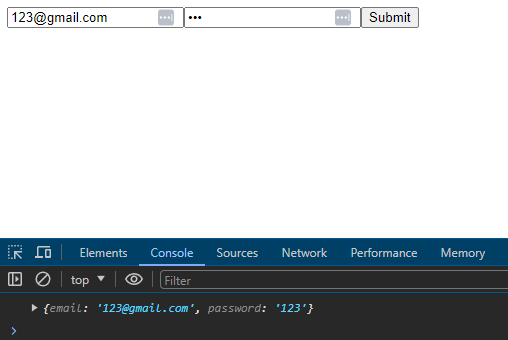
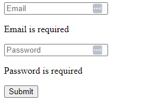
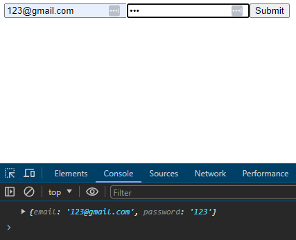
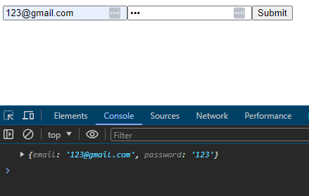
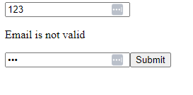

# Working with forms and form validation

## Introduction

In this article, i will explore how to work with forms in React. Although you can build forms using vanilla React, it normally requires a lot of boilerplate code. This is because the form is built using a combination of state and props. To make this process easier, i can use form libraries like Formik, React Hook Form or Final Form. These libraries provide a simpler way to manage form state and validation. In this article, i will focus on using React Hook Form to build forms in React.

## Setting up React Hook Form

To get started with React Hook Form, you need to install the library using npm or yarn. You can install it by running the following command:

```bash
npm install react-hook-form
# or
yarn add react-hook-form
```

Once you have installed the library, you can start using it in your components. Here's an example of how to set up a form using React Hook Form:

```jsx
import { useForm } from 'react-hook-form';

type Login = {
    email: string;
    password: string;
};

function App() {
    const { register, handleSubmit, formState: { errors } } = useForm<Login>();
    const onSubmit = (data: Login) => {
        console.log(data);
    };

    return (
        <form onSubmit={handleSubmit(onSubmit)}>
            <input type="email" placeholder="Email" {...register('email', { required: 'Email is required' })} />
            {errors.email && <p>{errors.email.message}</p>}

            <input type="password" placeholder="Password" {...register('password', { required: 'Password is required' })} />
            {errors.password && <p>{errors.password.message}</p>}

            <button type="submit">Submit</button>
        </form>
    );
}

export default App;
```



In the example above, i import the `useForm` hook from `react-hook-form`. I define a type `Login` to represent the form data. I then call the `useForm` hook and pass the `Login` type as a generic argument. This allows us to access the `register`, `handleSubmit`, and `formState` properties from the hook. The `register` function is used to register input fields with the form. I pass the name of the field and an object with validation rules to the `register` function. The `handleSubmit` function is used to handle form submission. I pass the `onSubmit` function to the `handleSubmit` function. The `formState` property contains information about the form state, such as errors. I destructure the `errors` object from the `formState` property and display error messages if the input fields are invalid. Finally, i render the form with input fields for email and password, and a submit button.

When i don't enter any value in the input field and click on the submit button, it will show the error message.



## Controller component

React Hook Form provides a `Controller` component that can be used to wrap input fields. The `Controller` component handles the registration of the input field and provides a way to access the field value and validation rules. Here's an example of how to use the `Controller` component:

```jsx
import { useForm, Controller } from 'react-hook-form';

type Login = {
    email: string;
    password: string;
};

function App() {
    const { control, handleSubmit, formState: { errors } } = useForm<Login>({
        defaultValues: {
            email: '',
            password: ''
        }
    });
    const onSubmit = (data: Login) => {
        console.log(data);
    };

    return (
        <form onSubmit={handleSubmit(onSubmit)}>
            <Controller
                name="email"
                control={control}
                rules={{ required: 'Email is required' }}
                render={({ field }) => <input type="email" placeholder="Email" {...field} />}
            />
            {errors.email && <p>{errors.email.message}</p>}

            <Controller
                name="password"
                control={control}
                rules={{ required: 'Password is required' }}
                render={({ field }) => <input type="password" placeholder="Password" {...field} />}
            />
            {errors.password && <p>{errors.password.message}</p>}

            <button type="submit">Submit</button>
        </form>
    );
}

export default App;
```



In the example above, i import the `Controller` component from `react-hook-form`. I define a type `Login` to represent the form data. I call the `useForm` hook and pass the `Login` type as a generic argument. I destructure the `control`, `handleSubmit`, and `formState` properties from the hook. The `control` property is used to register input fields with the form. I pass the `control` property to the `Controller` component as a prop. The `handleSubmit` function is used to handle form submission. I pass the `onSubmit` function to the `handleSubmit` function. The `formState` property contains information about the form state, such as errors. I destructure the `errors` object from the `formState` property and display error messages if the input fields are invalid. I render the form with input fields for email and password, and a submit button.

## Schema Validation with Yup and hook form resolver

React Hook Form provides a `resolver` property that can be used to validate the form data using a schema validation library like Yup. You can install Yup using npm or yarn by running the following command:

```bash
npm install @hookform/resolvers yup
# or
yarn add @hookform/resolvers yup
```

Once you have installed Yup, you can use it to define a schema for the form data. Here's an example of how to use Yup with React Hook Form:

```jsx
import { useForm, Controller } from 'react-hook-form';
import { yupResolver } from '@hookform/resolvers/yup';
import * as yup from 'yup';

type Login = {
    email: string;
    password: string;
};

// Define your schema
const schema = yup.object().shape({
    email: yup.string().required('Email is required').email('Email is not valid'),
    password: yup.string().required('Password is required'),
});

function App() {
    const { control, handleSubmit, formState: { errors } } = useForm<Login>({
        resolver: yupResolver(schema),
        defaultValues: {
            email: '',
            password: ''
        },
        mode: 'all'
    });
    const onSubmit = (data: Login) => {
        console.log(data);
    };

    return (
        <form onSubmit={handleSubmit(onSubmit)}>
            <Controller
                name="email"
                control={control}
                render={({ field }) => <input placeholder="Email" {...field} />}
            />
            {errors.email && <p>{errors.email.message}</p>}

            <Controller
                name="password"
                control={control}
                render={({ field }) => <input type="password" placeholder="Password" {...field} />}
            />
            {errors.password && <p>{errors.password.message}</p>}

            <button type="submit">Submit</button>
        </form>
    );
}

export default App;
```



In the example above, i import the `yupResolver` function from `@hookform/resolvers/yup` and the `yup` library. I define a type `Login` to represent the form data. I define a schema using Yup to validate the form data. The schema defines validation rules for the email and password fields. I call the `useForm` hook and pass the `Login` type as a generic argument. I pass the schema to the `resolver` property of the hook. I destructure the `control`, `handleSubmit`, and `formState` properties from the hook. The `control` property is used to register input fields with the form. I pass the `control` property to the `Controller` component as a prop. The `handleSubmit` function is used to handle form submission. I pass the `onSubmit` function to the `handleSubmit` function. The `formState` property contains information about the form state, such as errors. I destructure the `errors` object from the `formState` property and display error messages if the input fields are invalid. I render the form with input fields for email and password, and a submit button. When i enter an invalid email address and click on the submit button, it will show the error message.



## register vs Controller

The `register` function and the `Controller` component are two ways to register input fields with React Hook Form. The `register` function is used to register input fields directly in the form, while the `Controller` component is used to wrap input fields. The `register` function is more flexible and allows you to register input fields with the form using a custom input component. The `Controller` component is useful when you need to access the field value and validation rules in a custom input component. You can choose to use either the `register` function or the `Controller` component based on your requirements. In general, the `Controller` component is recommended when you need to access the field value and validation rules in a custom input component. The `register` function is recommended when you need to register input fields directly in the form. Both methods are valid and can be used interchangeably based on your requirements.

## Conclusion

React Hook Form, with its hooks, components, and integration with Yup, provides a comprehensive solution for working with forms and form validation in React. Whether you're building a simple or complex form, React Hook Form can help you manage form state and validation effectively and efficiently. By using React Hook Form, you can simplify the process of building forms in React and focus on creating a great user experience.

## References

- [React Hook Form](https://react-hook-form.com/)
- [React Hook Form - Get Started](https://react-hook-form.com/get-started)
- [ChatGPT](https://chat.openai.com/)
