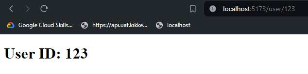
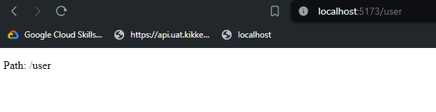

# Routing in React using React Router

Routing is the process of determining which component to display based on the URL. React Router is a popular library that allows you to add routing to your React applications. I will cover the basics of routing, including setting up routes, creating links, and passing parameters to routes.

## Note

In this article, I will use the `react-router-dom` package version 6.22.3 to demonstrate routing in React. The syntax and usage may vary depending on the version of the package you are using. Please refer to the [React Router documentation](https://reactrouter.com/en/main) for the most up-to-date information.

## Installation

To use React Router in your project, you need to install the `react-router-dom` package. You can do this using npm or yarn:

```bash
npm install react-router-dom
# or
yarn add react-router-dom
```

## Setting up routes

To define routes in your application, you need to use the `BrowserRouter` component from `react-router-dom`. This component wraps your entire application and provides the routing functionality. You can define routes using the `Route` component, which takes two props: `path` and `component`. The `path` prop specifies the URL path for the route, and the `component` prop specifies the component to render when the path matches. Here's an example of setting up routes in your application:

```jsx
import React from 'react';
import { BrowserRouter, Route } from 'react-router-dom';
import Home from './components/Home';
import About from './components/About';

function App() {
  return (
    <BrowserRouter>
        <Routes>
            <Route path="/" Component={Home} />
            <Route path="/about" Component={About} />
        </Routes>
    </BrowserRouter>
  );
}

export default App;
```

In this example, we have defined two routes: one for the home page (`/`) and one for the about page (`/about`). When the user navigates to these paths, the corresponding components (`Home` and `About`) will be rendered.

## Some other useful components

React Router provides several other useful components for building complex routing logic:

- `Routes`: Renders the first `Route` or `Redirect` that matches the current location.
- `Route`: Renders a component based on the URL path.
- `Link`: Navigates to a different route.
- `NavLink`: A special version of `Link` that applies styling when the link is active.
- ...and many more.

React Router also provides several hooks for working with routes:

- `useParams`: A hook that returns the parameters from the current route.
- `useLocation`: A hook that returns the current location object.
- `useResolvedPath`: A hook that returns the match object for the current route.
- ...and more.

By using these components and hooks, you can build powerful routing logic in your React applications.

### Routes

The `Routes` component is used to render the first `Route` or `Redirect` that matches the current location. It is similar to the `Switch` component in React Router v5. Here's an example of using the `Routes` component:

```jsx

import { BrowserRouter, Route, Routes } from 'react-router-dom';
import Home from './components/Home';
import About from './components/About';
import NotFound from './components/NotFound';

function App() {
    return (
        <BrowserRouter>
            <Routes>
                <Route path="/" Component={Home} />
                <Route path="/about" Component={About} />
                <Route path="*" Component={NotFound} />
            </Routes>
        </BrowserRouter>
    );
}

export default App;
```

In this example, we have defined three routes: one for the home page (`/`), one for the about page (`/about`), and one for any other path (`*`). If the user navigates to a path that does not match any of the defined routes, the `NotFound` component will be rendered.

### Route

The `Route` component is used to render a component based on the URL path. It takes two props: `path` and `component`. The `path` prop specifies the URL path for the route, and the `component` prop specifies the component to render when the path matches. Here's an example of using the `Route` component:

```jsx
import { BrowserRouter, Route, Routes } from 'react-router-dom';
import Home from './components/Home';

function App() {
    return (
        <BrowserRouter>
            <Routes>
                <Route path="/" Component={Home} />
            </Routes>
        </BrowserRouter>
    );
}

export default App;
```

In this example, we have defined a route for the home page (`/`). When the user navigates to the home page, the `Home` component will be rendered. You can define multiple routes in the `Routes` component to handle different paths in your application.

### Link

The `Link` component is used to navigate to a different route. It is similar to the `a` tag in HTML but provides a declarative way to navigate between routes in a React application. Here's an example of using the `Link` component:

```jsx
import React from 'react';
import { Link } from 'react-router-dom';

function Navigation() {
  return (
    <nav>
      <ul>
        <li>
          <Link to="/">Home</Link>
        </li>
        <li>
          <Link to="/about">About</Link>
        </li>
        <li>
          <Link to="/contact">Contact</Link>
        </li>
      </ul>
    </nav>
  );
}

export default Navigation;
```

In this example, the Navigation component renders a navigation bar with three links: Home, About, and Contact. When clicked, each Link will navigate to the corresponding route ("/", "/about", or "/contact").

### NavLink

The `NavLink` component is a special version of `Link` that applies styling when the link is active. It is useful for highlighting the current route in a navigation bar. Here's an example of using the `NavLink` component:

```jsx
import { NavLink } from "react-router-dom";

<NavLink
  to="/messages"
  className={({ isActive, isPending }) =>
    isPending ? "pending" : isActive ? "active" : ""
  }
>
  Messages
</NavLink>;
```

In this example, the `NavLink` component will apply the "active" class when the link is active (when the user is on the "/messages" route). You can also provide a custom class based on the `isActive` and `isPending` props.

### useParams

You can pass parameters to routes by using the `Route` component's `path` prop. Parameters are specified using a colon (`:`) followed by the parameter name. You can access the parameters in the component using the `useParams` hook from `react-router-dom`. Here's an example of passing parameters to routes:

```jsx
import { BrowserRouter, Route, Routes, useParams } from 'react-router-dom';

function User() {
    const { id } = useParams();

    return <h1>User ID: {id}</h1>;
}

function App() {
    return (
        <BrowserRouter>
            <Routes>
                <Route path="/user/:id" Component={User} />
            </Routes>
        </BrowserRouter>
    );
}

export default App;
```



In this example, we have defined a route with a parameter (`/user/:id`). When the user navigates to a URL like `/user/123`, the `User` component will be rendered, and the `id` parameter will be extracted using the `useParams` hook.

### useLocation

The `useLocation` hook from `react-router-dom` returns the current location object, which contains information about the current URL path. You can use this hook to access the current path, search parameters, and state. Here's an example of using the `useLocation` hook:

```jsx
import { BrowserRouter, Route, Routes, useLocation } from 'react-router-dom';

function User() {
    const location = useLocation();

    return (
        <>
            <p>Path: {location.pathname}</p>
        </>
    );
}

function App() {
    return (
        <BrowserRouter>
            <Routes>
                <Route path="/user" Component={User} />
            </Routes>
        </BrowserRouter>
    );
}

export default App;
```



In this example, the `User` component uses the `useLocation` hook to access the current path (`location.pathname`). You can also access other properties of the location object, such as `search` and `state`.

## Conclusion

React Router is a powerful library that allows you to add routing to your React applications. By using the `BrowserRouter`, `Routes`, `Route`, `Link`, and other components provided by React Router, you can create complex routing logic in your applications.

## References

- [React Router Documentation](https://reactrouter.com/en/main)
- [Cách sử dụng Routing trong ReactJS](https://fullstack.edu.vn/blog/phan-1routing-trong-reactjs-1.html)
