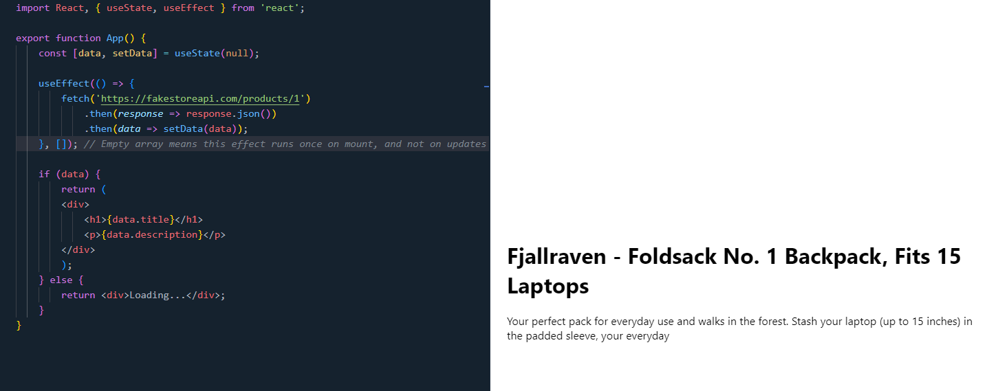

# Introduction to Context, Hooks in React

## Context in React

Context provides a way to pass data through the component tree without having to pass props down manually at every level. It is designed to share data that can be considered "global" for a tree of React components. Context is primarily used when some data needs to be accessible by many components at different nesting levels.

### Creating a Context

To create a new context in React, you can use the `createContext` function from the `react` package. This function returns an object with two components: `Provider` and `Consumer`.

- **Provider**: The `Provider` component is used to provide the data to the components that are consuming the context. It accepts a `value` prop that will be passed to the consuming components.
- **Consumer**: The `Consumer` component is used to consume the data provided by the `Provider`. It uses a render prop pattern to access the context value.

Here's an example of how you can create and use a context in React:

```jsx
import React, { createContext, useContext } from 'react';

// Create a new context
const MyContext = createContext();

// Create a provider component
const MyProvider = ({ children }) => {
    const value = 'Hello, Context!';
    return <MyContext.Provider value={value}>{children}</MyContext.Provider>;
};

// Create a consumer component
const MyConsumer = () => {
    const value = useContext(MyContext);
    return <div>{value}</div>;
};

// Usage
export function App() {
    return (
        <>
            <MyProvider>
                <MyConsumer />
            </MyProvider>
        </>
    )
}
```


In this example, we create a new context called `MyContext` using the `createContext` function. We then define a `Provider` component called `MyProvider` that provides the value `'Hello, Context!'` to its children. Finally, we define a `Consumer` component called `MyConsumer` that consumes the value provided by the `Provider`. When the `MyConsumer` component is rendered inside the `MyProvider`, it will display the value `'Hello, Context!'`.

## Hooks in React

Hooks are a new addition in React 16.8 that allow you to use state and other React features without writing a class. They provide a more direct API to the React concepts you already know, such as state, lifecycle methods, context, and more.

Commonly used hooks include:

- **useState**: A hook that allows you to add state to functional components.
- **useEffect**: A hook that allows you to perform side effects in functional components.
- **useContext**: A hook that allows you to access context in functional components.
- **useReducer**: A hook that allows you to manage state with reducers in functional components.
- **useRef**: A hook that allows you to create mutable references in functional components.
- **useMemo**: A hook that allows you to memoize values in functional components.
- **useCallback**: A hook that allows you to memoize callbacks in functional components.

### useState Hook

The `useState` hook allows you to add state to functional components. It returns an array with two elements: the current state value and a function to update the state. Here's an example of how you can use the `useState` hook:

```jsx
import React, { useState } from 'react';

function App() {
    const [count, setCount] = useState(0);
    
    return (
        <div>
            <p> Count: {count} </p>
            <button onClick={() => setCount(count + 1)}>Click</button>
        </div>
    )
}

export default App;
```


In this example, I use the `useState` hook to add a count state to the functional component `App`. I initialize the count state to `0` and provide a button that increments the count when clicked. The `setCount` function is used to update the count state. The current value of the count state is displayed in the paragraph element.

### useEffect Hook

The `useEffect` hook allows you to perform side effects in functional components. It is similar to lifecycle methods in class components, such as `componentDidMount`, `componentDidUpdate`, and `componentWillUnmount`. Here's an example of how you can use the `useEffect` hook:

```jsx
import React, { useState, useEffect } from 'react';

function App() {
    const [data, setData] = useState(null);

    useEffect(() => {
        fetch('https://api.example.com/data')
            .then(response => response.json())
            .then(data => setData(data));
    }, []); // Empty array means this effect runs once on mount, and not on updates

    if (data) {
        return (
            <div>
                <h1>{data.title}</h1>
                <p>{data.description}</p>
            </div>
        );
    } else {
        return <div>Loading...</div>;
    }
}

export default App;
```



In this example, I use the `useEffect` hook to fetch data from an API when the component mounts. The effect runs once when the component mounts due to the empty dependency array `[]`. Once the data is fetched, it is stored in the `data` state using the `setData` function. If the data is available, the title and description are displayed; otherwise, a loading message is shown.

### useReducer Hook

The `useReducer` hook allows you to manage state with reducers in functional components. It is similar to the `useState` hook but provides more control over complex state logic. Here's an example of how you can use the `useReducer` hook:

```jsx
import React, { useReducer } from 'react';

const initialState = { count: 0 }

function Reducer(state, action) {
  switch (action.type) {
    case 'increment':
      return { count: state.count + 1 };
    case 'decrement':
      return { count: state.count - 1 };
    default:
      throw new Error();
  }
}

function App() {
  const [state, dispatch] = useReducer(Reducer, initialState);

  return(
    <div>
      <p>Count: {state.count}</p>
      <button onClick={() => dispatch({ type: 'increment' })}>Increment</button>
      <button onClick={() => dispatch({ type: 'decrement' })}>Decrement</button>
    </div>
  )
}

export default App;
```


In this example, I use the `useReducer` hook to manage the count state with a reducer function called `Reducer`. The `Reducer` function takes the current state and an action object as arguments and returns the new state based on the action type. The `useReducer` hook returns the current state and a `dispatch` function to update the state based on the action type. I provide two buttons to increment and decrement the count state by dispatching the corresponding actions. The current value of the count state is displayed in the paragraph element.

### useRef Hook

The `useRef` hook allows you to create mutable references in functional components. It is useful for accessing DOM elements, managing focus, and storing mutable values. Here's an example of how you can use the `useRef` hook:

```jsx
import React, { useRef, useEffect } from 'react';

function App() {
  console.log('render');
  const inputEl = useRef(null);

  const onButtonClick = () => {
    // current property is pointing to the actual input element
    inputEl.current.focus();
    console.log(inputEl.current.value);
  };

  useEffect(() => {
    // Automatically focus on input field when component mounts
    inputEl.current.focus();
  }, []); // Empty array ensures effect runs only once at mount

  return (
    <>
      <input ref={inputEl} type='text' />
      <button onClick={onButtonClick}>Focus the input</button>
    </>
  );
}

export default App;
```


In this example, I use the `useRef` hook to create a mutable reference to an input element. The `inputEl` ref is initialized with `useRef(null)`, and the `ref` attribute is added to the input element to assign the ref. I define a function `onButtonClick` that focuses on the input element when the button is clicked. I also use the `useEffect` hook to automatically focus on the input field when the component mounts. The empty dependency array `[]` ensures that the effect runs only once when the component mounts. The current value of the input element is logged to the console when the button is clicked.

### useMemo Hook

The `useMemo` hook allows you to memoize values in functional components. It is useful for optimizing performance by caching expensive calculations. Here's an example of how you can use the `useMemo` hook:

```jsx
import React, { useState, useMemo } from 'react';

const NumberList = ({ numbers }) => {
  const [sum, setSum] = useState(0);

  const calculateSum = useMemo(() => {
    console.log('Calculating sum...');
    let total = 0;
    for (let num of numbers) {
      total += num;
    }
    return total;
  }, [numbers]);

  const handleClick = () => {
    setSum(calculateSum);
  };

  return (
    <div>
      <button onClick={handleClick}>Calculate Sum</button>
      <p>Sum: {sum}</p>
    </div>
  );
};

function App() {
  const numbers = [1, 2, 3, 4, 5];

  return <NumberList numbers={numbers} />;
};

export default App;
```


In this example, I use the `useMemo` hook to memoize the `calculateSum` function, which calculates the sum of the numbers array. The `calculateSum` function is only recalculated when the `numbers` array changes. The `handleClick` function updates the `sum` state with the calculated sum when the button is clicked. The current value of the sum state is displayed in the paragraph element. The console log statement inside the `useMemo` hook shows that the calculation is only performed when the `numbers` array changes. This optimization helps improve performance by avoiding unnecessary calculations.


And this example when not using `useMemo` it will calculate the sum every time when click the button and console log will show that.

### useCallback Hook

The `useCallback` hook allows you to memoize callbacks in functional components. It is useful for optimizing performance by caching callback functions. Here's an example of how you can use the `useCallback` hook:

```jsx
import React, { useState, useCallback } from 'react';

function Counter() {
  const [count, setCount] = useState(0);

  const increment = useCallback(() => {
    setCount(count => count + 1);
  }, []); // Empty array ensures that function is only created once per component instance

  return (
    <div>
      Count: {count}
      <button onClick={increment}>Increment</button>
    </div>
  );
}

export default Counter;
```


In this example, I use the `useCallback` hook to memoize the `increment` function, which increments the count state. The `increment` function is only created once per component instance due to the empty dependency array `[]`. This optimization helps improve performance by avoiding unnecessary function re-creations. The `increment` function is passed as a callback to the button's `onClick` event handler to increment the count state when clicked. The current value of the count state is displayed in the paragraph element.

## Conclusion

In this guide, we covered the basics of using context and hooks in React. Context provides a way to share data across components without prop drilling, while hooks allow you to use state and other React features in functional components. By leveraging context and hooks, you can build more flexible and efficient React applications.

## References

- [React Context](https://reactjs.org/docs/context.html)
- [React Hooks](https://reactjs.org/docs/hooks-intro.html)
- [React Hooks API Reference](https://reactjs.org/docs/hooks-reference.html)
- [ChatGPT](https://chat.openai.com/)
